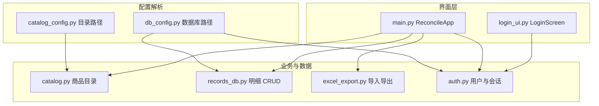

# ItemCalcFinance（对账小工具）

面向本地使用的桌面小工具：按商品目录录入对账明细，数据写入 SQLite，支持导出 / 导入 Excel 与按角色区分的数据范围。

## 功能概览

| 能力 | 说明 |
|------|------|
| 登录 / 注册 | 用户名 + 密码；**首位注册用户自动成为管理员**，其余为普通用户 |
| 商品目录 | 从 **JSON** 或 **Excel（.xlsx / .xlsm）** 加载分类、商品名、默认单价 |
| 录入对账 | 选择分类与商品，填写数量与单价（可改），自动计算总价后提交到本地库 |
| 导出 Excel | 生成「对账记录」工作表，并附带「汇总分析」（按用户、按商品汇总等） |
| 批量导入 Excel | **仅管理员**：将符合格式的 `.xlsx` 合并进同一数据库（追加，可能重复） |
| 清空历史 | 管理员清空**全部**明细；普通用户仅清空**本人**提交的明细 |
| 退出登录 | 返回登录界面，不退出进程 |

数据默认仅存本机；不涉及云端同步。

## 技术栈

- **语言**：Python 3（推荐 3.10+，使用 `from __future__ import annotations` 等写法）
- **界面**：标准库 **Tkinter**（`tk` / `ttk`），中文界面字体示例为「Microsoft YaHei UI」
- **存储**：**SQLite**（`sqlite3`），用户表与对账明细表在同一库文件
- **金额与数量**：**`decimal.Decimal`** 解析与量化，减少浮点误差
- **Excel**：**openpyxl**（`requirements.txt` 中 `openpyxl>=3.1.2`）
- **认证**：**PBKDF2-HMAC-SHA256**（约 21 万次迭代）+ 随机盐；密码校验使用 `secrets.compare_digest`

## 架构与模块



| 文件 | 职责 |
|------|------|
| [`main.py`](main.py) | 程序入口；启动时加载商品目录、确保数据库与用户表；登录成功后构建主窗口与对账流程 |
| [`login_ui.py`](login_ui.py) | 登录页、注册弹窗 |
| [`auth.py`](auth.py) | `users` 表结构、`register_user`、`authenticate`、`UserSession`（含 `is_admin`） |
| [`records_db.py`](records_db.py) | `line_items` 表迁移与插入、按用户或全局删除 |
| [`catalog.py`](catalog.py) | `Category` / `Item` 数据类；JSON 与 Excel「商品目录」工作表解析 |
| [`excel_export.py`](excel_export.py) | 导出 `.xlsx`（对账记录 + 汇总分析）；管理员合并导入 |
| [`db_config.py`](db_config.py) | 解析 SQLite 文件路径（环境变量 / `app_config.json` / 默认） |
| [`catalog_config.py`](catalog_config.py) | 解析商品目录文件路径（环境变量 / `app_config.json` / 默认） |

## 目录与数据文件

```
ItemCalcFinance/
├── main.py                 # 运行入口
├── auth.py
├── login_ui.py
├── records_db.py
├── catalog.py
├── catalog_config.py
├── db_config.py
├── excel_export.py
├── requirements.txt
├── README.md
└── data/
    ├── app_config.example.json   # 配置示例（可复制为 app_config.json）
    ├── products.json             # 可选：JSON 格式商品目录示例
    └── products_catalog.xlsx     # 默认：Excel 商品目录（需自行准备）
```

首次运行若默认路径下没有商品目录文件，程序会提示错误并说明如何通过配置指定路径。

## 环境要求与安装

1. 安装 [Python 3](https://www.python.org/downloads/)（建议 3.10+）。
2. 在项目根目录执行：

```bash
pip install -r requirements.txt
```

3. 准备商品目录：
   - **Excel**：工作表名为「商品目录」（若无则使用第一张表），首行为表头：`分类`、`商品名`、`单价`；
   - 或 **JSON**：根节点含 `categories` 数组，结构与 [`data/products.json`](data/products.json) 类似。

## 配置说明

优先级见各模块文档字符串摘要：

**数据库路径**（[`db_config.py`](db_config.py)）

1. 环境变量 `ITEMCALC_DB`（绝对路径，或相对项目根的路径）
2. `data/app_config.json` 中的 `database_path`
3. 默认：`data/reconcile.db`

**商品目录路径**（[`catalog_config.py`](catalog_config.py)）

1. 环境变量 `ITEMCALC_CATALOG`
2. `data/app_config.json` 中的 `catalog_path`
3. 默认：`data/products_catalog.xlsx`

可将 [`data/app_config.example.json`](data/app_config.example.json) 复制为 `data/app_config.json` 后修改。示例中 `database_path` 使用了 `%ProgramData%` 等环境变量展开（Windows）。

## 运行

在项目根目录执行：

```bash
python main.py
```

## 数据库结构（摘要）

- **`users`**：`username`（不区分大小写唯一）、`salt`、`password_hash`、`role`（`user` / `admin`）、`created_at`
- **`line_items`**：`product_name`、`quantity`、`unit_price`、`total_price`、`submitted_at`、`submitted_by`（提交用户名）

管理员导出为**全部用户**明细；普通用户导出与清空仅针对**当前登录用户**的 `submitted_by`。

## Excel 对账导出 / 导入

- **导出**工作表「对账记录」表头固定为：`序号`、`提交用户`、`商品名`、`数量`、`单价`、`总价`、`提交时间`；另有一张「汇总分析」统计表。
- **导入**（管理员）：要求首行与上述表头**完全一致**（见 [`excel_export.py`](excel_export.py) 中 `HEADERS`），否则拒绝导入。重复导入同一文件会**追加**重复行，请注意备份 `reconcile.db`。

## 部署与注意事项

- 数据在默认配置下位于本机 SQLite 文件；请定期备份数据库文件。
- 多个客户端**同时写入**网络盘上**同一个** SQLite 文件，可能产生锁竞争或损坏风险；若多用户使用，建议每人独立库文件或控制并发并备份。
- 本项目为内部对账辅助工具，请在受信任环境中使用，并做好操作系统与文件权限管理。

## 许可证

若仓库未单独提供许可证文件，以项目所有者约定为准。
